# Introduction
This repository contains code for the **Ensuring Quality Releases** project of the cd1807 Ensuring Quality Releases (Quality Assurance) course taught by Nathan Anderson. The project is a capstone for the Azure Devops nanodegree and consists of Infrastructure as Code with Terraform, a CI/CD pipeline with Azure and testing with JMeter, Postman & Selenium.

# Getting Started
This readme is not intended to be a step-by-step tutorial of how to run the project. Instead, this serves to show the various images as required by the project rubric.

For reference, the following links cover the required topics:
- [Azure account](https://portal.azure.com/)
- [Azure devops account](https://dev.azure.com/)
- [Service principal](https://registry.terraform.io/providers/hashicorp/azurerm/latest/docs/guides/service_principal_client_secret)
- [Azure self hosted pipeline agent](https://learn.microsoft.com/en-us/azure/devops/pipelines/agents/v2-linux?view=azure-devops)
- [Azure custom log](https://learn.microsoft.com/en-us/azure/azure-monitor/agents/data-sources-custom-logs)
- [Azure email alerts](https://learn.microsoft.com/en-us/azure/azure-monitor/essentials/monitor-azure-resource)
- [JMeter](https://jmeter.apache.org/), [Postman](https://www.postman.com/) and [Selenium](https://www.selenium.dev/)

# Project Rubric Items

## 1. Terraform Execution on CI/CD Pipeline
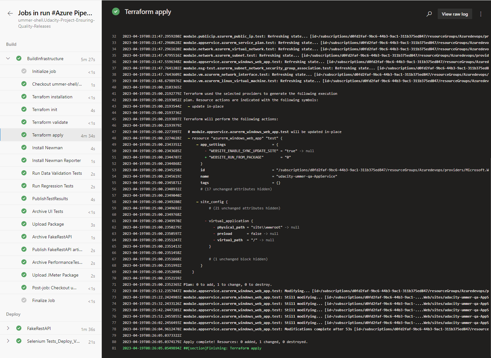

## 2. CI/CD Pipeline
The pipeline script could be improved by better splitting the stages (e.g. provision, build, test and deploy), however the structure of the starter code was retained to ensure consistent formatting for project reviewers.
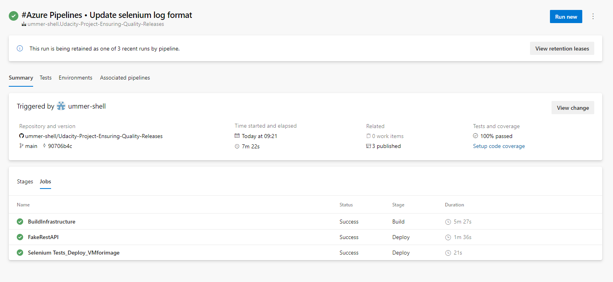

## 3. JMeter Performance Testing

### A. Endurance Test HTML Report
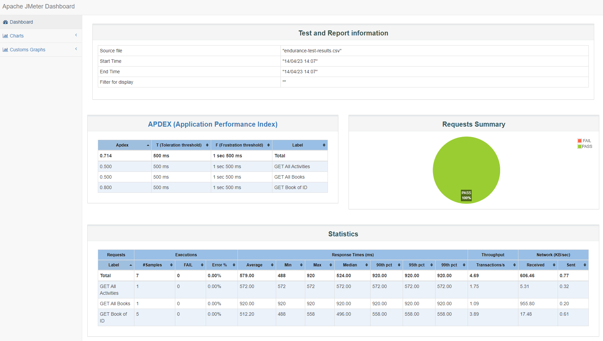

### B. Stress Test HTML Report
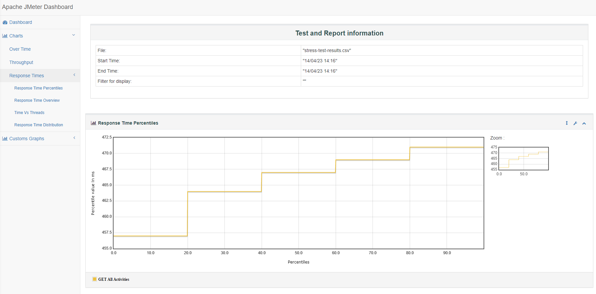

### C. CI/CD Pipeline Output
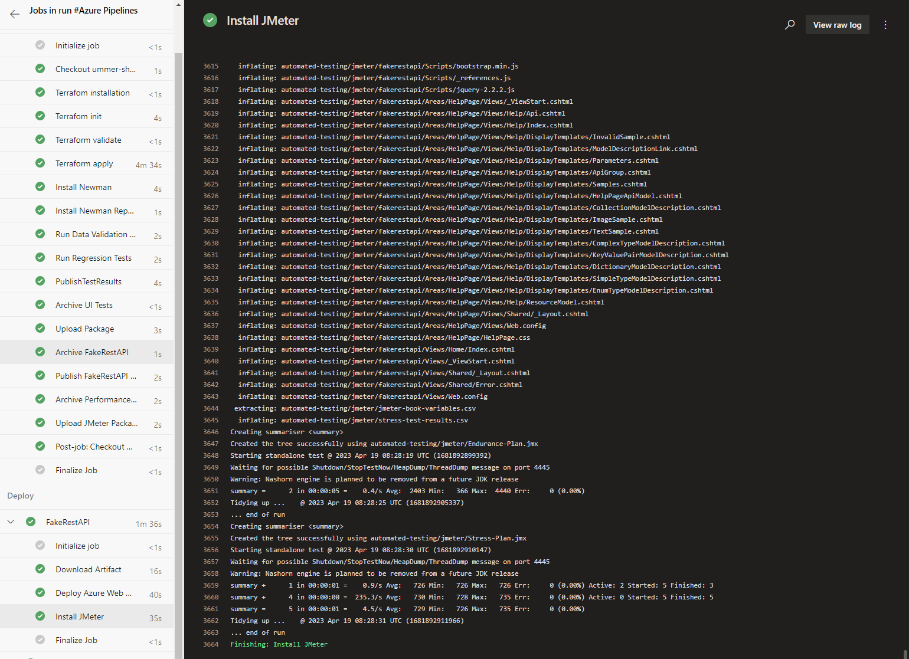

# 4. Postman API Test
Note: For Postman tests, the [site](https://dummy.restapiexample.com/api/v1/create) mentioned in the project briefing material did not work.
Instead, the site https://jsonplaceholder.typicode.com was used as per the comment by Manjunath in the Udacity Knowledge forum question #862097.

## A. Run Summary
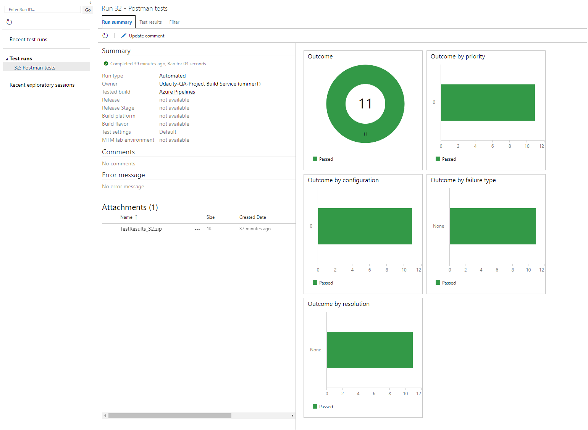

## B. Data Validation
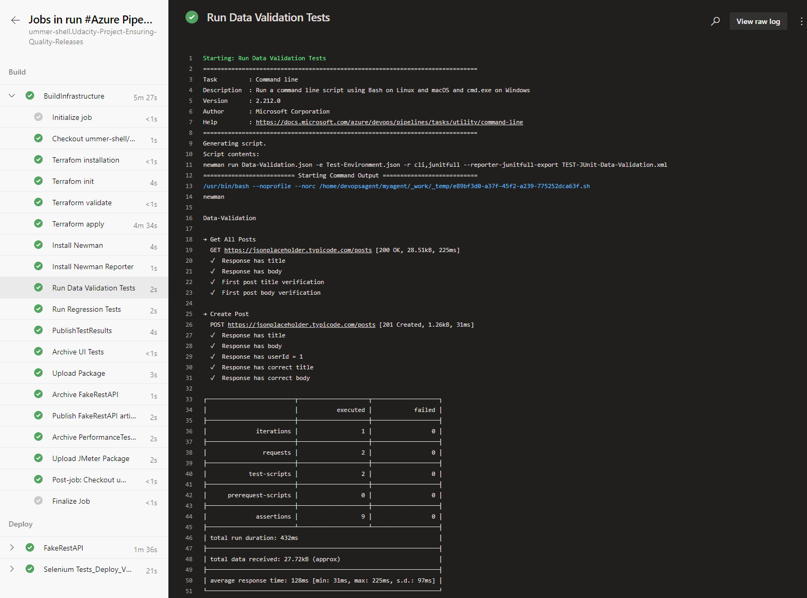

## C. Regression
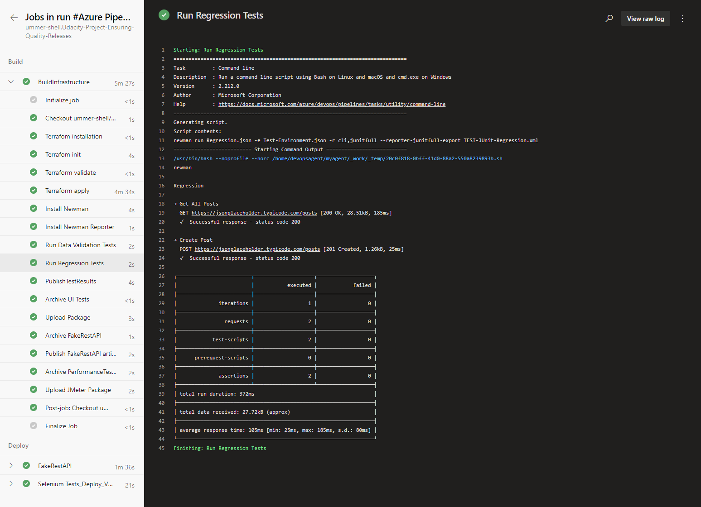

# 5. Selenium UI Test

## A. CI/CD Pipeline Output
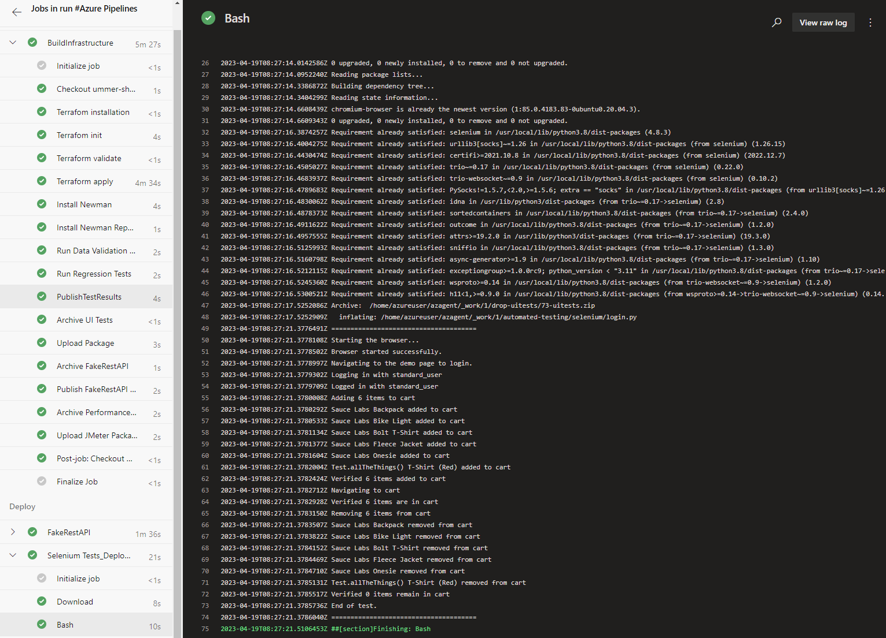

## B. Azure Custom Log
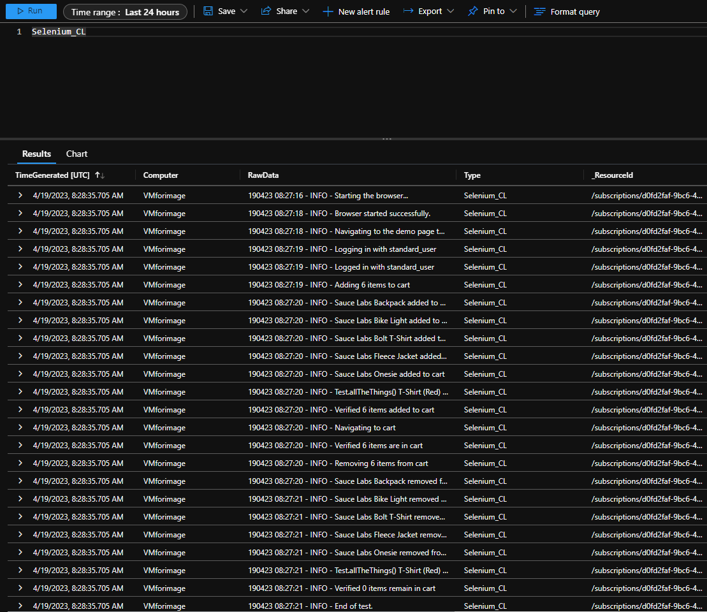

# 6. Azure Monitoring

## A. Azure Monitoring Chart
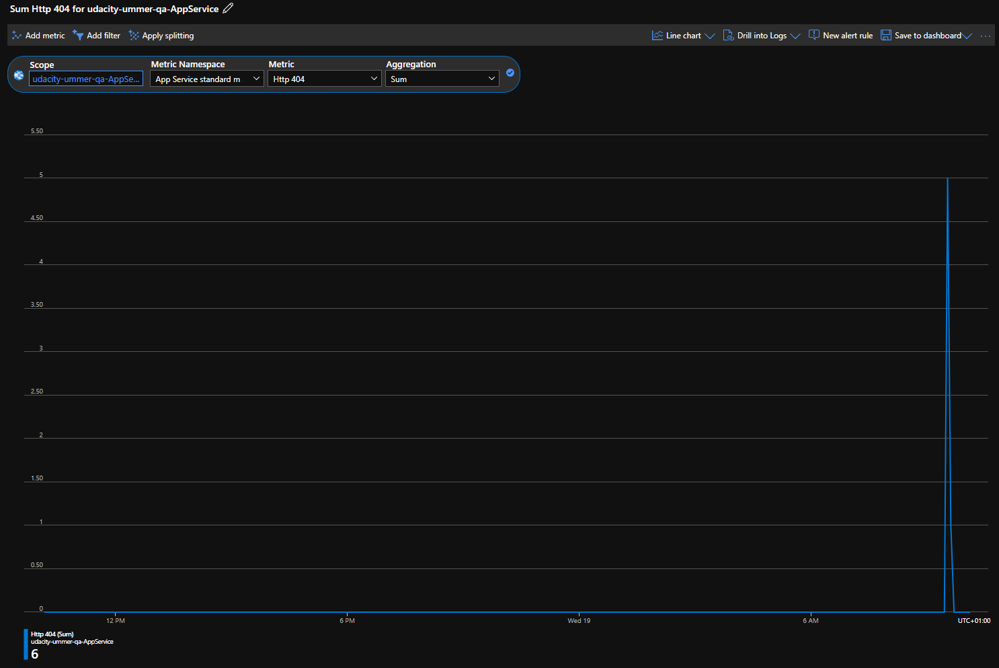

## B. Email Alert
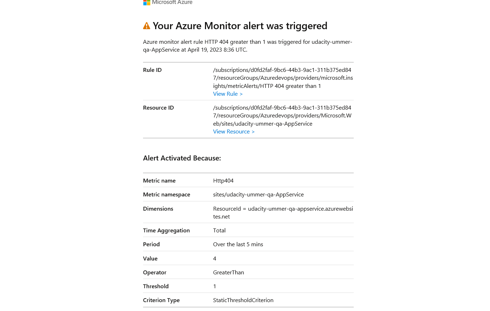